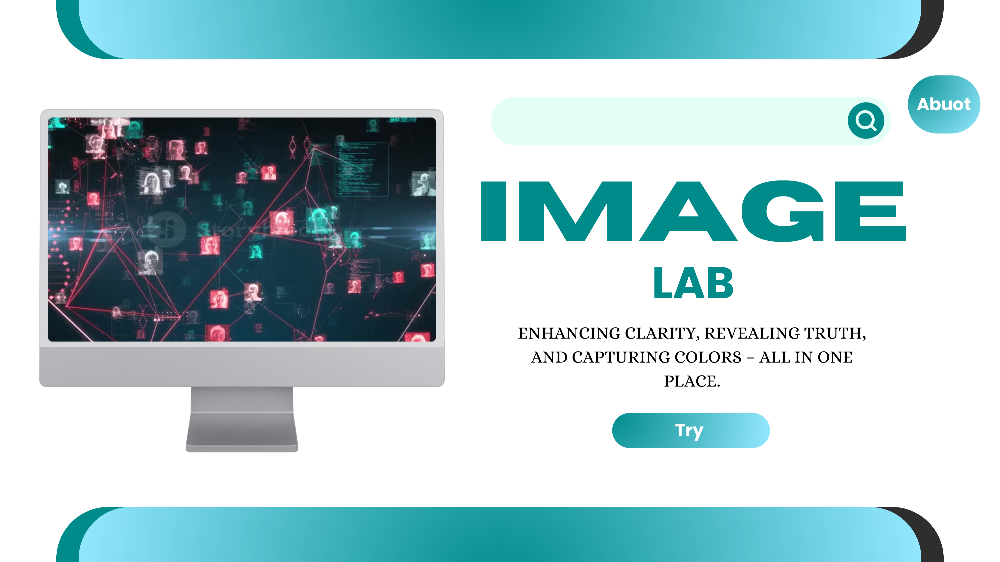
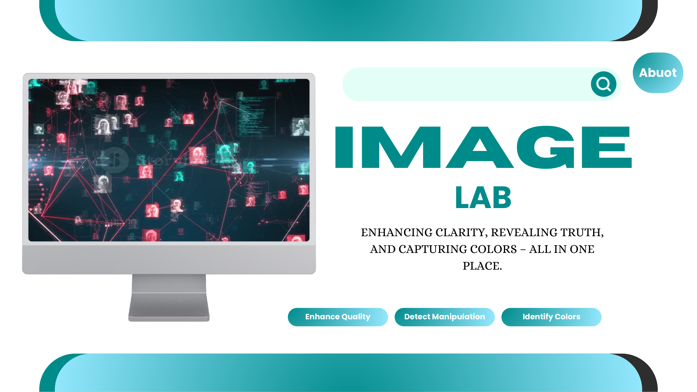
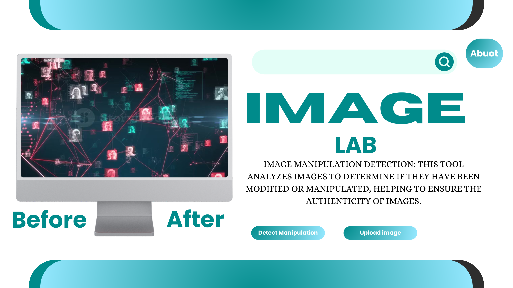

# IMAGE_LAB: Digital Image Processing & Forensics

## Overview
IMAGE_LAB is a web-based platform built with Flask for advanced image analysis, enhancement, and digital forensics. It provides tools for researchers and developers to perform complex image operations through an intuitive interface.

## Core Modules

### 1. Image Enhancement
*   **Dynamic Adjustments:** Control brightness, contrast, and sharpness.
*   **Color Optimization:** Enhance saturation and vibrancy.
*   **High-Quality Scaling:** Resize images using Lanczos interpolation for maximum detail retention.

### 2. Digital Forensics
*   **Manipulation Detection:** Identify tampered regions using Discrete Cosine Transform (DCT) analysis.
*   **Frequency Analysis:** Leverage Wavelet transforms to detect noise inconsistencies.
*   **ML Classification:** Integrated Support Vector Machine (SVM) models for authenticity verification.

### 3. Color Analytics
*   **Dominant Color Extraction:** Automated identification of primary color palettes.
*   **Standardized Mapping:** RGB to web-standard color name conversion.
*   **Distribution Analysis:** Visual insights into color space utilization.

## Technical Architecture

| Layer | Technology |
| :--- | :--- |
| **Backend** | Python / Flask |
| **Processing** | OpenCV, Pillow, scikit-image |
| **Analysis** | NumPy, SciPy, PyWavelets, scikit-learn |
| **Frontend** | HTML5, CSS3, JavaScript |

## Application Preview

### Dashboard


### Enhancement Tools


### Forensic Analysis


### Color Results


## Installation

1.  **Clone the repository:**
    ```bash
    git clone https://github.com/Eng-Akil-Alsufi/IMAGE_LAB.git
    ```

2.  **Install requirements:**
    ```bash
    pip install -r requirements.txt
    ```

3.  **Launch:**
    ```bash
    python app.py
    ```

## Author
**Eng-Akil-Alsufi** - [GitHub Profile](https://github.com/Eng-Akil-Alsufi)

## License
This project is licensed under the MIT License.
